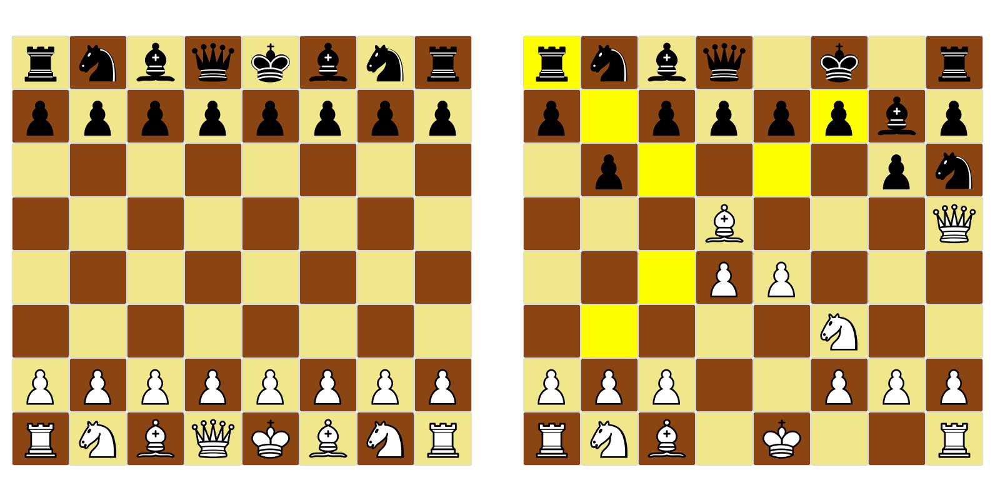

# Schachspiel

Ein einfaches graphisches online Scachspielprogramm fuer zwei Spieler.

## Anforderungen

- JRE

## UI

Das Programm hat ein graphisches UI, das wie ein Schachbrett aussieht.

Nach einem Klick auf einer Schachfigur werden die Trittmoeglichkeiten gelb gafaerbt. Falls der Spieler ein gelbes Feld klickt, wird der frueher ausgewaehlter Figur da treten, andernfalls wird der Auswahl zurueckgenommen.

## Anfang des Spiels

Das Spiel kann zwei verschiedene Wege launchiert werden, im Server oder im Kunde Modus. Im Server Modus ein Portnummer, im Kunde Modus die Hostnummer und Portnummer der Server muessen angegeben werden. Der Server kann eine Seite (Weiß oder Schwarz) waehlen.

## Regeln

Die Regeln sind die Regeln von Schach, außer dass Rochade und Respawn schon nicht moeglich sind.

### Ende des Spiels

Das Spiel is vorbei, wenn eine der Spieler seinen König verliert.